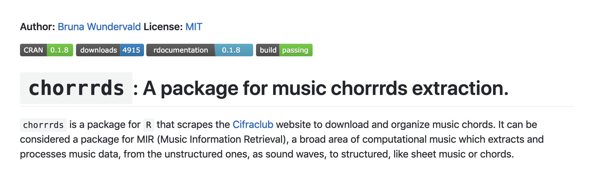
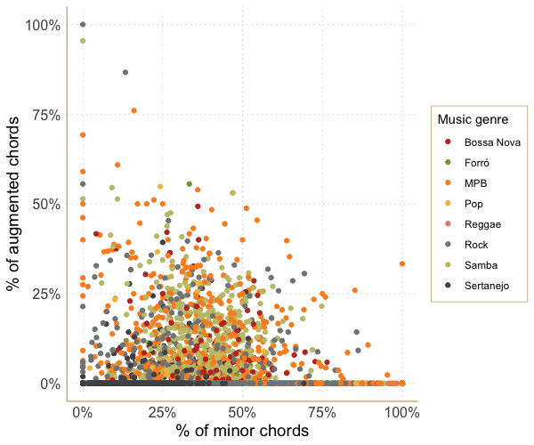
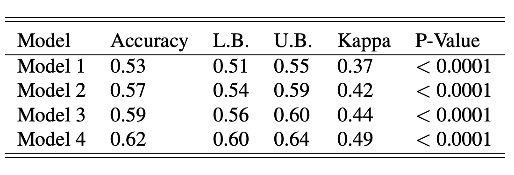
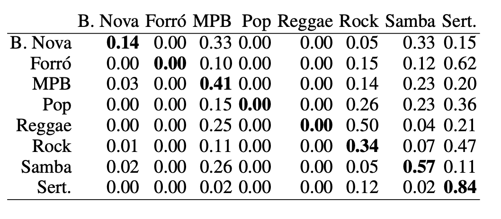
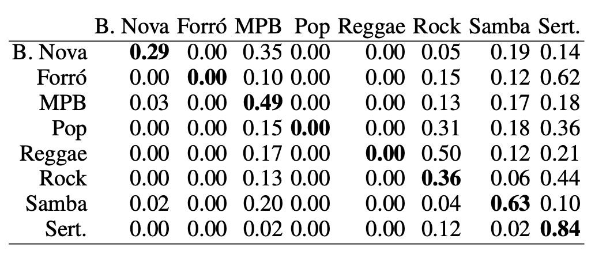
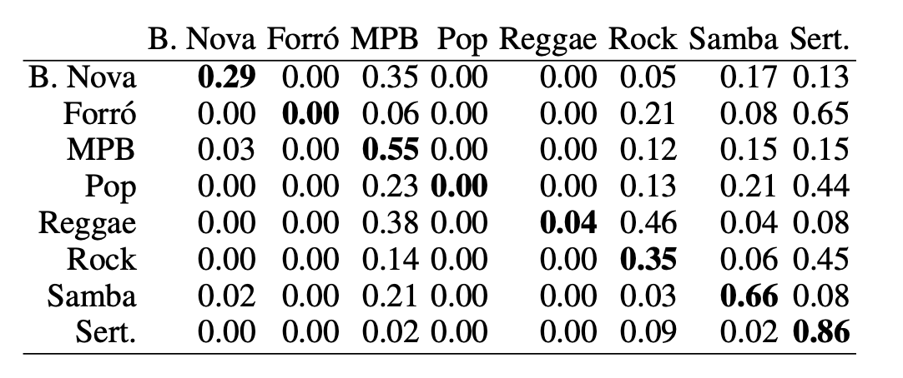
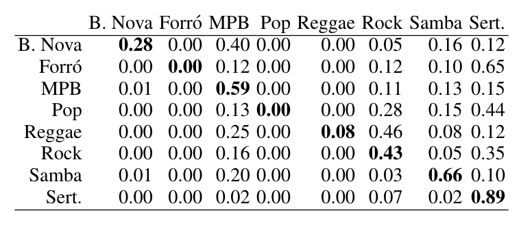
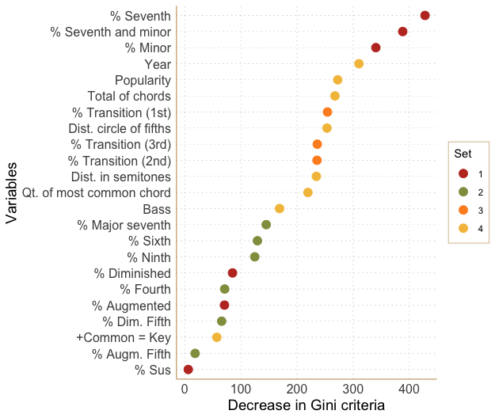

```{r setup, include=FALSE}
options(htmltools.dir.version = FALSE)
knitr::opts_chunk$set(warning = FALSE, message = FALSE, 
                      comment = NA, dpi = 300,
                      fig.align = "center", 
                      out.width = "70%", 
                      cache = FALSE,
                      echo = FALSE)
library(tidyverse)
library(RefManageR)
bib_file = "presentation/bibliography.bib"
bib <- ReadBib(bib_file, check = FALSE)

```


class: middle

# Summary
  
  
  - Introduction
  - Materials
    - Data Extraction
    - Feature Engineering
  - Music Genre Modeling
    - Engineered Variables
    - Random Forests
  - Results 
  - Conclusions

---
# Introduction

- Music Information Retrieval
  - Develop & apply computational tools combined with
  music theory,  
  - Amplify our understanding of music data.

- Each data format has its own properties: audio, chords,
lyrics, sheet music, etc. 

> Musical genres are hard to describe: many factors are
involved, such as style, music technique, and historical
context
  - Some genres even have overlapping characteristics
  
- The chords sequence of a song fully describes its
harmonic structure. 

- **The focus of this work is to establish a connection between harmonic information and genre specification in Brazilian popular music.**

---
# Materials
## Data Extraction

- Chords progressions are a sequence of chords that happen in a particular form. 

- Data extraction: through *webscraping* of the 
[Cifraclub Website](https://www.cifraclub.com.br/)
  - from the underlying *html* structures of each
  chords webpages. 

- 8 Brazilian musical genres were selected, resulting in 
106 artists and 8339 different songs.
  - Bossa Nova, Forró, MPB, Pop, Reggae, Rock, Samba e Sertanejo.

- We collected the chords, keys and the name of songs and artists. 

- Variables about the release year and popularity were obtained 
with the aid of the Spotify API. 

---
# Materials
## Data Extraction

> Resulting package: `chorrrds`

```{r}

```


[**R-Music Blog**](https://r-music.rbind.io/) 

<h4 style="padding:0px;margin:10px;">
R for music data extraction and analysis
</h4>


---
# Materials 
## Feature Engineering

- Using only the raw information about the chords progression 
may cause a lot of information to be lost in the process. 

- Feature engineering: can be either automatic or manual. 

- We emphasized on obtaining various distinct
features from the chords by-hand.

- The resulting features have a clear interpretation about 
harmonic characteristics of the considered songs.


---
# Materials 
## Engineered Variables

Group 1  - Triads and simple tetrads:
  - % of suspended chords (e.g. Gsus), 
  - % of chords with the seventh (e.g. C7),
  - %  of minor chords with the seventh (e.g. Em7 C#m7),
  - %  of minor chords (e.g. Em C#m),
  - %  of diminished chords (e.g. Bº),
  - % of augmented chords (e.g. Baug),
  
  
Group 2 - Dissonant Tetrads:    

  - % of chords with the fourth (e.g. D4),
  - % of chords with the sixth (e.g. E6), 
  - % of chords with the ninth (e.g. G9),
  - % of minor chords with the major seventh (e.g. Am7+),
  - % of chords with a diminished fifth (e.g. C5- or C5b),
  - % of chords with as augmented fifth (e.g. C5+ ou C5#)
  

---
# Materials 
## Engineered Variables

Group 3 - Common transitions:   

  - % of the first most common chord transition, 
  - % of the second most common chord transition, 
  - % of the third most common chord transition, 
  
Group 4 - Miscellany:   

  - Popularity of the song, extracted from the Spotify API,
  - Total of non-distinct chords,
  - Year of album release, extracted from the Spotify API,
  - Indicator of the key of the song being the same as the most common chord,
  - Percentage of chords with varying bass (e.g. C/G, C/Bb),
  - Mean distance of the chords to the ’C’ chord in the circle of fifths,
  - Mean distance of the chords to the ’C’ chord in semitones,
  - Absolute quantity of the most common chord.


---
# Music Genre Modeling
## Random Forests


Consider a variable of interest $Y_i$ that defines the labels 
of the genres, represented by $\{1,\dots,K\}$ 
and $\mathbf{x} = (x_{i1},\dots, x_{ip})'$ ,
$1 \leq i \leq n$, the set of predictor variables. 

A tree is a flexible 
non-parametric method, based on the estimation of a series of 
binary conditional splitting statements on the predictors'space, 
that creates rules with the form: $x_j > x_{j,th}$,
where $x_j$ is the value of the feature at $j$ and $x_{j,th}$ 
is the decision cut point. The space is divided into $m$ 
regions, $R_1,\dots, R_m$,
and the proportion of the classes in each region is estimated as

$$\hat p_{mk} = \frac{1}{N_{m_{x_i \in R_m}}} I_{y_i = k}$$


---
# Music Genre Modeling
## Random Forests

The usual criteria to choose the best threshold for a new node is 
the Gini impurity `r Cite(bib[key = "Hastie"])`, measured by

\begin{equation}
Gini = 1 - \sum_{k = 1}^{K} p_k^{2},   
\end{equation}

where $p_k$ is the observed proportion for each class $k = 1,..K.$ in 
the dataset. This measure has its minimum when the individuals belong 
to the same class. 


Random forests `r Cite(bib[key = "Breiman2001"])` are an extension 
of tree-based methods, combining B trees that are grown on bootstrapped 
samples, but for each tree only a  sample $m \approx \sqrt p$ of the
predictors is considered as splitting nodes. The prediction is a combination
of all of the results in the training set.

---
# Music Genre Modeling
## Random Forests

- The performance of the algorithm needs to be evaluated regarding 
its prediction power:
  - Train set: 70%
  - Test set: 30% 

The closer the predictions are to the vector of observations,
the better the algorithm is doing, and an accuracy measure is 
calculated as 

\begin{equation}
Acc = \frac{1}{n} \sum_{i = 1}^{n}
I(y_i \neq \hat y_i)
\end{equation}
where $I$ is the indicator for whether the model
prediction $\hat y_i$ is compatible with 
what was observed and $n$ is the sample size 

---
# Music Genre Modeling
## Random Forests

Advantages of a random forest:
  - nonlinear decision regions between the covariables are better
captured, 
  - it easily allows the obtention of an importance measure of the 
  predictors,
  - the trees are invariant to the predictors'scales. 
  
In total, four models were fitted, in a nested fashion, structured as

1. First model: triads (6)
2. Second model: triads (6) + tetrads (6
3. Third model: triads (6) + tetrads (6) + common transitions (3)
4. Fourth model: triads (6) + tetrads (6) + common
transitions (3) + miscellany (8).

---

## Nonlinearity example


```{r, fig.cap = "Figure 2. Percentage of minor chords in the song versus the percentage of augmented chords, identifying the musicg genre"}

```


---

# Results 

Table 1 shows the results for the *Kappa* statistic, a metric of comparison
between the observed accuracy and the expected accuracy 
`r Cite(bib[key = "Cohen1960"])`. 

- The expected accuracy (or Non-Information Rate) is the proportion of 
the most recurrent genre in the dataset (34%). 

- The statistic is used to decide whether the classification proposed by 
the model is more accurate than saying that all
observations belong to that genre. 

```{r, fig.cap="Table 1. Goodness of fit for the four models: overall accuracy with lower and upper bounds and Kappa statistic with the respective p-value."}

```


---


```{r, fig.cap="Table 2. Confusion matrix for the model with only the first set of variables."}

```


```{r, fig.cap="Table 3.  Confusion matrix for the second model with the first and second sets of variables."}

```

---


```{r, fig.cap="Table 4. Confusion matrix for third model with the first, second and third sets of variables"}

```


```{r, fig.cap="Table 5. Confusion matrix for the fourth model with all the considered variables."}

```


---

# Results 

- From Table 2 to Table 3, there is a considerable increase in the 
correct classification rate, especially for Bossa Nova (about 15%), 
MPB (about 8%) and Samba (about 6%); 

- In Table 4, the increase occurs to MPB (about 6%), Samba and Sertanejo
(about 2% for both), but it’s more intense for Reggae (4%).
  - with the information about the common chords
transitions, at least some percentage of it is being distinguished. 

- On Table 5, the increase was especially high for
Rock (about 8%), followed MPB, and Reggae (about 4%
for both) and Sertanejo (about 3% of increase). 

  - we verify that the fourth set of variables, the miscellany
is notably relevant in the classification of those genres. 

---

# Results 

```{r, fig.cap="Figure 1. Importance plot for the fourth model with all the considered variables."}

```

---

# Results 
 - The first set of variables is the most informative one.
  - with the basic information about the songs we already obtained good
  results.
 
 - The results improved mostly by the addition of external variables,  
 such as the year and popularity of each song.
  - Shows how the features from Spotify carry relevant information about
  the the evaluated genres. 
 
 - Next, in the importance sequence, we have the transitions and 
distances variables, strengthening the idea of harmonic characteristics  
being important to discriminate music genre.  


---

# Conclusions

-  Is possible to  satisfactorily predict music genres of the 
Brazilian popular music combining features extracted from 
harmonic structures and external variables. 

- The overall accuracy of the final model is 62% with a confidence 
interval of [60%, 64%]. 
  - the better-classified genres are the Brazilian Sertanejo, Samba, MPB  and Rock. 

- The most discriminative variables for the model are
  - the percentage of chords with the seventh note, 
  - percentage of minor chords with the seventh note, 
  - the percentage of minor chords, 
  - the year of release of the songs, 
  - their popularity, 
  - the behavior of the most common chord transitions. 


- On this group, prevail the features that can be extracted purely with
the symbolic part of the chords. 

---

# Conclusions

Every step of this analysis can be reproduced using the code 
available at: `https://github.com/brunaw/genre_classification`

- Next steps of this work include especially the engineering of
the new variables and applying different algorithms to model the
data. 
- The modeling section can be improved in two fundamental
ways: 
  - changing the algorithm itself for another suitable technique and
  - improving the existent model.

> Source code for this presentation: `https://github.com/brunaw/XVI_EMR` 
---
class: center, middle

## Acknowledgments

This work was supported by a Science Foundation Ireland Career Development Award grant number: 17/CDA/4695

```{r, echo=FALSE, fig.align='center', out.height="40%", out.width="50%", fig.height=2}
knitr::include_graphics("img/SFI_logo.jpg")
```


---
# References


```{r, results='asis'}
print(bib[key = c("Hastie", "Cohen1960",  
                   "rmusic", "chorrrds")], 
      .opts = list(check.entries = TRUE, 
                   style = "html", 
                   bib.style = "authoryear"))
```


---

# References


```{r, results='asis'}
print(bib[key = c("Rsoftware", "Breiman2001",
                  "Absolu2010", "chordsp", "Schettino2017", 
                  "PerezSancho2010")], 
      .opts = list(check.entries = TRUE, 
                   style = "html", 
                   bib.style = "authoryear"))
```


---


class: center, middle, inverse

# Thanks!

 

<b>

[@brunaw](https://github.com/brunaw)